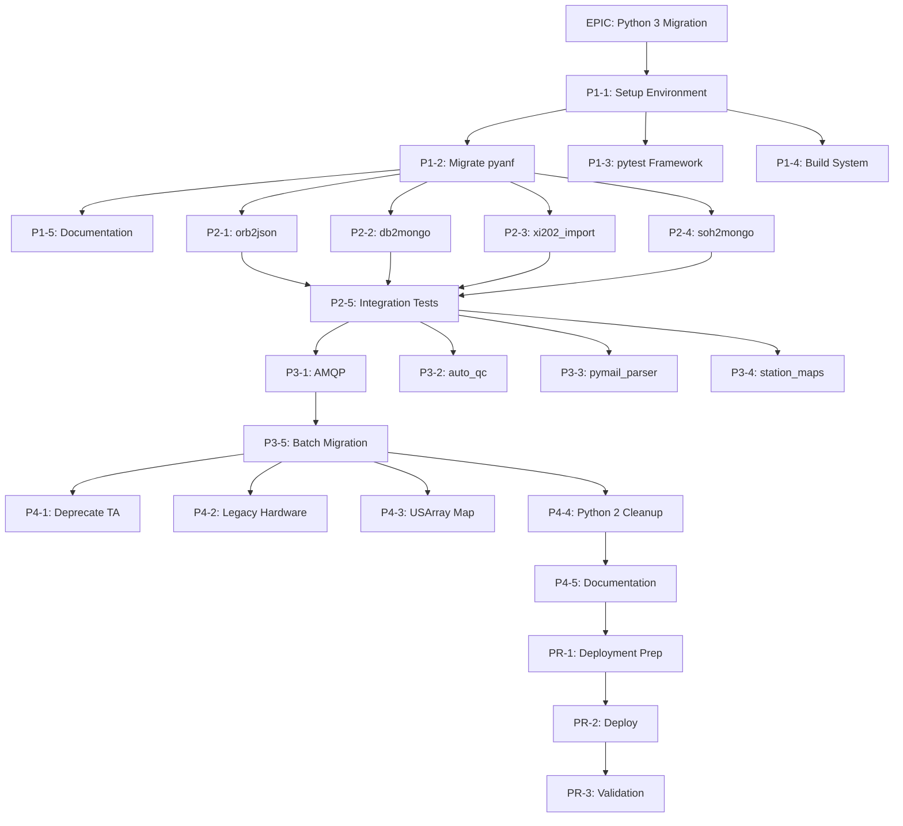

# ANFSRC Python 3 Migration - GitHub Issues and Project Board

## Project Board Structure

### Board Name: ANFSRC Python 3 Migration

### Columns:
1. **Backlog** - All unstarted issues
2. **Ready** - Issues ready to start (dependencies met)
3. **In Progress** - Active work
4. **In Review** - Code review or testing
5. **Blocked** - Issues with blockers
6. **Done** - Completed issues

### Milestones:
- **Phase 1: Foundation** (Due: Week 4)
- **Phase 2: Critical Infrastructure** (Due: Week 12)
- **Phase 3: Utility Migration** (Due: Week 20)
- **Phase 4: Cleanup & Deprecation** (Due: Week 26)
- **Production Release** (Due: Week 30)

## Labels Structure

### Priority Labels
- `priority-critical` (red) - Blocks other work
- `priority-high` (orange) - Core functionality
- `priority-medium` (yellow) - Important utilities
- `priority-low` (green) - Nice to have

### Phase Labels
- `phase-1-foundation` (purple)
- `phase-2-infrastructure` (blue)
- `phase-3-utilities` (cyan)
- `phase-4-cleanup` (gray)

### Type Labels
- `type-migration` - Python 2 to 3 conversion
- `type-deprecation` - Component removal
- `type-testing` - Test development
- `type-documentation` - Documentation updates
- `type-infrastructure` - Build/environment setup

### Status Labels
- `status-blocked` - Waiting on dependencies
- `status-needs-review` - Ready for review
- `status-needs-testing` - Requires testing
- `status-breaking-change` - Contains breaking changes

### Component Labels
- `component-orb` - ORB-related
- `component-mongodb` - MongoDB integration
- `component-amqp` - Message queue
- `component-pyanf` - Core libraries
- `component-web` - Web services
- `component-utility` - Utility scripts

## Detailed Issues

### EPIC Issue

```markdown
# [EPIC] Migrate ANFSRC from Python 2 to Python 3

## Overview
Complete migration of 157 Python files from Python 2 to Python 3, with deprecation of obsolete components.

## Scope
- 144 .xpy executables
- 13 .py libraries
- 214+ Python 2 pattern instances
- 30-40% deprecation targets

## Success Criteria
- [ ] All critical components migrated to Python 3.8/3.10
- [ ] No degradation in real-time performance
- [ ] Zero data loss during migration
- [ ] 90% test coverage achieved
- [ ] All deprecated components moved to /anf/no_build/

## Timeline
- Start Date: [TBD]
- Target Completion: 26 weeks
- Production Release: 30 weeks

## Resources
- Lead Developer: [TBD]
- Python Developer: [TBD]
- QA Engineer: [TBD]
- System Admin: [TBD]

## Linked Issues
- See comments for phase-specific issues

**Labels:** `epic`, `priority-critical`, `type-migration`
**Milestone:** Production Release
```

---

## Phase 1: Foundation Issues (Weeks 1-4)

### Issue #1: Setup Python 3 Development Environment

```markdown
# [P1-1] Setup Python 3 Development Environment

## Description
Establish Python 3.8 and 3.10 development environments with Antelope 5.9 integration.

## Tasks
- [ ] Install Python 3.8 and 3.10
- [ ] Configure virtual environments
- [ ] Install Antelope Python bindings
- [ ] Setup development tools (pytest, 2to3, pylint)
- [ ] Create environment setup documentation
- [ ] Test Antelope integration

## Acceptance Criteria
- Python 3 environments accessible to all developers
- Antelope bindings functional in Python 3
- Development tools installed and configured
- Documentation complete

## Dependencies
- Antelope 5.9 development license

**Labels:** `phase-1-foundation`, `priority-critical`, `type-infrastructure`
**Milestone:** Phase 1: Foundation
**Assignee:** System Admin
**Estimate:** 3 days
```

### Issue #2: Migrate Core pyanf Libraries

```markdown
# [P1-2] Migrate /anf/lib/pyanf Core Libraries to Python 3

## Description
Convert core pyanf library modules from Python 2 to Python 3.

## Files to Migrate
- [ ] `/anf/lib/pyanf/anf/__init__.py`
- [ ] `/anf/lib/pyanf/anf/logutil.py`
- [ ] `/anf/lib/pyanf/anf/staq330.py`
- [ ] `/anf/lib/pyanf/anf/orbpf.py`
- [ ] `/anf/lib/pyanf/anf/pktutil.py`
- [ ] `/anf/lib/pyanf/anf/deploymentmap.py`
- [ ] `/anf/lib/pyanf/anf/xmlparser.py`
- [ ] `/anf/lib/pyanf/anf/gmt.py`

## Migration Checklist
- [ ] Run 2to3 on all modules
- [ ] Fix string/bytes handling
- [ ] Update exception syntax
- [ ] Fix print statements
- [ ] Update imports (urllib, etc.)
- [ ] Add type hints where appropriate
- [ ] Create unit tests
- [ ] Update docstrings
- [ ] Test with downstream dependencies

## Testing Requirements
- Unit tests for each module
- Integration tests with sample data
- Performance benchmarks

**Labels:** `phase-1-foundation`, `priority-critical`, `type-migration`, `component-pyanf`
**Milestone:** Phase 1: Foundation
**Assignee:** Lead Developer
**Estimate:** 5 days
```

### Issue #3: Create pytest Testing Framework

```markdown
# [P1-3] Establish pytest Testing Framework

## Description
Set up comprehensive testing framework using pytest for migrated Python 3 code.

## Tasks
- [ ] Install pytest and plugins
- [ ] Create test directory structure
- [ ] Write test templates
- [ ] Setup coverage reporting
- [ ] Configure CI integration
- [ ] Create testing guidelines documentation

## Deliverables
- Test framework configuration
- Sample test files
- Coverage configuration
- CI/CD pipeline setup
- Testing documentation

## Acceptance Criteria
- pytest runs successfully
- Coverage reports generated
- CI pipeline triggers on commits
- Documentation complete

**Labels:** `phase-1-foundation`, `priority-high`, `type-testing`
**Milestone:** Phase 1: Foundation
**Assignee:** QA Engineer
**Estimate:** 3 days
```

### Issue #4: Update Build System for Python 3

```markdown
# [P1-4] Update ANF Build System for Python 3 Support

## Description
Modify Makefiles and build scripts to support Python 3 compilation and installation.

## Tasks
- [ ] Update `/anf/lib/makerules/` for Python 3
- [ ] Modify install paths for Python 3
- [ ] Add Python version detection
- [ ] Update .xpy compilation rules
- [ ] Test parallel Python 2/3 builds
- [ ] Document build changes

## Files to Modify
- `/anf/lib/makerules/anf.mk`
- `/anf/lib/makerules/anf_python.mk`
- `/adm/coldstart/Makefile`

## Testing
- Build with Python 2 (verify no regression)
- Build with Python 3
- Parallel installation test

**Labels:** `phase-1-foundation`, `priority-critical`, `type-infrastructure`
**Milestone:** Phase 1: Foundation
**Assignee:** Lead Developer
**Estimate:** 2 days
```

### Issue #5: Document Python 3 Migration Patterns

```markdown
# [P1-5] Create Python 3 Migration Pattern Documentation

## Description
Document common migration patterns and solutions for ANFSRC-specific code.

## Documentation Sections
- [ ] String/bytes handling for ORB
- [ ] MongoDB driver changes
- [ ] Exception handling updates
- [ ] Import statement changes
- [ ] File I/O encoding
- [ ] Pickle protocol compatibility
- [ ] Common 2to3 failures

## Deliverables
- Migration patterns guide
- Code examples (before/after)
- Troubleshooting guide
- FAQ section

**Labels:** `phase-1-foundation`, `priority-medium`, `type-documentation`
**Milestone:** Phase 1: Foundation
**Assignee:** Lead Developer
**Estimate:** 2 days
```

---

## Phase 2: Critical Infrastructure Issues (Weeks 5-12)

### Issue #6: Migrate orb2json Real-time Converter

```markdown
# [P2-1] Migrate /anf/bin/web/orb2json to Python 3

## Description
Convert critical ORB to JSON real-time data converter to Python 3.

## Critical Considerations
- Binary protocol handling
- Real-time performance requirements
- Backwards compatibility

## Migration Tasks
- [ ] Analyze current ORB binary handling
- [ ] Run 2to3 conversion
- [ ] Fix bytes/string issues in ORB packets
- [ ] Update JSON encoding
- [ ] Test with live ORB feed
- [ ] Performance benchmarking
- [ ] Parallel run validation

## Testing Requirements
- [ ] Unit tests for packet parsing
- [ ] Integration test with test ORB
- [ ] 24-hour parallel run test
- [ ] Performance comparison

## Risk Mitigation
- Maintain Python 2 version during testing
- Implement feature flag for version switching
- Create rollback procedure

**Labels:** `phase-2-infrastructure`, `priority-critical`, `type-migration`, `component-orb`, `component-web`
**Milestone:** Phase 2: Critical Infrastructure
**Assignee:** Lead Developer
**Estimate:** 5 days
```

### Issue #7: Update MongoDB Integration (db2mongo)

```markdown
# [P2-2] Migrate /anf/bin/web/db2mongo to Python 3

## Description
Update database to MongoDB converter for Python 3 and pymongo 3.x.

## Breaking Changes
- pymongo Connection → MongoClient
- Collection.save() deprecated
- New connection pooling

## Migration Tasks
- [ ] Update to pymongo 3.x
- [ ] Fix Connection → MongoClient
- [ ] Update collection operations
- [ ] Handle connection pooling changes
- [ ] Update error handling
- [ ] Test data integrity
- [ ] Benchmark performance

## Data Validation
- [ ] Compare document counts
- [ ] Verify field mappings
- [ ] Check index creation
- [ ] Validate timestamps

**Labels:** `phase-2-infrastructure`, `priority-critical`, `type-migration`, `component-mongodb`, `component-web`
**Milestone:** Phase 2: Critical Infrastructure
**Assignee:** Python Developer
**Estimate:** 4 days
```

### Issue #8: Migrate Critical Data Import (xi202_import)

```markdown
# [P2-3] Migrate /anf/bin/import/xi202_import to Python 3

## Description
Convert critical xi202 data import utility to Python 3.

## Key Concerns
- File encoding handling
- Binary data parsing
- Database write operations

## Migration Tasks
- [ ] Analyze data format requirements
- [ ] Run 2to3 conversion
- [ ] Fix file I/O encoding
- [ ] Update binary data handling
- [ ] Test with sample xi202 files
- [ ] Validate database writes
- [ ] Create regression tests

## Testing Data
- Historical xi202 files
- Edge case samples
- Performance benchmarks

**Labels:** `phase-2-infrastructure`, `priority-high`, `type-migration`, `component-import`
**Milestone:** Phase 2: Critical Infrastructure
**Assignee:** Python Developer
**Estimate:** 3 days
```

### Issue #9: Migrate State of Health Monitor (soh2mongo)

```markdown
# [P2-4] Migrate /anf/bin/web/soh2mongo to Python 3

## Description
Convert state of health MongoDB integration to Python 3.

## Dependencies
- Requires completed pyanf migration (#2)
- Requires MongoDB driver update patterns (#7)

## Migration Tasks
- [ ] Update MongoDB connection code
- [ ] Fix ORB packet handling
- [ ] Update health metric calculations
- [ ] Test alert generation
- [ ] Validate historical data compatibility
- [ ] Performance testing

## Monitoring Validation
- [ ] All health metrics captured
- [ ] Alert thresholds working
- [ ] Dashboard compatibility
- [ ] No data gaps

**Labels:** `phase-2-infrastructure`, `priority-high`, `type-migration`, `component-mongodb`, `component-web`
**Milestone:** Phase 2: Critical Infrastructure
**Assignee:** Python Developer
**Estimate:** 3 days
```

### Issue #10: Integration Testing for Phase 2

```markdown
# [P2-5] Phase 2 Integration Testing Suite

## Description
Comprehensive integration testing for all Phase 2 migrated components.

## Test Scenarios
- [ ] ORB → orb2json → MongoDB pipeline
- [ ] Database → db2mongo → MongoDB flow
- [ ] xi202 import → Database validation
- [ ] SOH monitoring end-to-end
- [ ] 48-hour stability test
- [ ] Performance benchmarks

## Success Criteria
- No data loss
- <5% performance degradation
- All alerts functioning
- Zero crashes in 48 hours

**Labels:** `phase-2-infrastructure`, `priority-critical`, `type-testing`
**Milestone:** Phase 2: Critical Infrastructure
**Assignee:** QA Engineer
**Estimate:** 5 days
```

---

## Phase 3: Utility Migration Issues (Weeks 13-20)

### Issue #11: Migrate AMQP Message Processing

```markdown
# [P3-1] Migrate /anf/bin/utility/AMQP to Python 3

## Description
Convert AMQP message queue processing utilities to Python 3.

## Components
- AMQP publisher
- AMQP subscriber
- Queue management utilities

## Migration Tasks
- [ ] Update AMQP library to Python 3 version
- [ ] Fix message encoding/decoding
- [ ] Update connection handling
- [ ] Test message delivery
- [ ] Validate message ordering
- [ ] Load testing

## Testing Requirements
- Unit tests for message handling
- Integration with test broker
- Performance benchmarks
- Failure recovery testing

**Labels:** `phase-3-utilities`, `priority-high`, `type-migration`, `component-amqp`
**Milestone:** Phase 3: Utility Migration
**Assignee:** Python Developer
**Estimate:** 4 days
```

### Issue #12: Migrate Quality Control System (auto_qc)

```markdown
# [P3-2] Migrate /anf/bin/utility/auto_qc to Python 3

## Description
Convert automated quality control system including Cython modules.

## Special Considerations
- Cython module compilation
- Numerical computation accuracy
- Performance critical code

## Migration Tasks
- [ ] Update Cython to Python 3
- [ ] Recompile Cython modules
- [ ] Fix NumPy compatibility
- [ ] Update QC algorithms
- [ ] Validate QC metrics
- [ ] Performance optimization

## Validation
- Compare QC results with Python 2
- Benchmark performance
- Test edge cases

**Labels:** `phase-3-utilities`, `priority-high`, `type-migration`, `component-utility`
**Milestone:** Phase 3: Utility Migration
**Assignee:** Lead Developer
**Estimate:** 5 days
```

### Issue #13: Migrate Email Processing (pymail_parser)

```markdown
# [P3-3] Migrate /anf/bin/utility/pymail_parser to Python 3

## Description
Update email parsing utilities for station reports and alerts.

## Email Components
- IMAP connection handling
- MIME parsing
- Alert generation
- Report extraction

## Migration Tasks
- [ ] Update email libraries
- [ ] Fix string encoding in emails
- [ ] Test IMAP connections
- [ ] Validate MIME parsing
- [ ] Test alert generation
- [ ] Update regex patterns

**Labels:** `phase-3-utilities`, `priority-medium`, `type-migration`, `component-utility`
**Milestone:** Phase 3: Utility Migration
**Assignee:** Python Developer
**Estimate:** 3 days
```

### Issue #14: Migrate Station Mapping Tools

```markdown
# [P3-4] Migrate /anf/bin/web/station_maps to Python 3

## Description
Convert station mapping and visualization tools.

## Visualization Components
- Map generation
- KML export
- Plot creation

## Migration Tasks
- [ ] Update matplotlib
- [ ] Fix basemap compatibility
- [ ] Update KML generation
- [ ] Test plot rendering
- [ ] Validate coordinate systems
- [ ] Browser compatibility testing

**Labels:** `phase-3-utilities`, `priority-medium`, `type-migration`, `component-web`
**Milestone:** Phase 3: Utility Migration
**Assignee:** Python Developer
**Estimate:** 3 days
```

### Issue #15: Batch Migration of Remaining Utilities

```markdown
# [P3-5] Batch Migrate Remaining Utility Scripts

## Description
Systematic migration of remaining lower-priority utilities.

## Utilities List
- calculate_azimuth
- plot_beachballs
- rotation_comparison
- second_moment
- timezone_query
- [Additional utilities as identified]

## Process
- [ ] Create migration priority list
- [ ] Run batch 2to3 conversion
- [ ] Manual review each utility
- [ ] Basic testing
- [ ] Documentation updates

**Labels:** `phase-3-utilities`, `priority-low`, `type-migration`, `component-utility`
**Milestone:** Phase 3: Utility Migration
**Assignee:** Python Developer
**Estimate:** 8 days
```

---

## Phase 4: Cleanup and Deprecation Issues (Weeks 21-26)

### Issue #16: Deprecate TA-Specific Components

```markdown
# [P4-1] Deprecate and Archive TA-Specific Utilities

## Description
Move Transportable Array specific components to /anf/no_build/.

## Components to Deprecate
- [ ] /anf/bin/utility/check_tastation/
- [ ] /anf/bin/utility/dbwfserver_ta_setup/
- [ ] /anf/bin/db/aec_TApick_review/
- [ ] /anf/bin/db/check_ta_build/

## Tasks
- [ ] Document deprecation reasons
- [ ] Identify any active users
- [ ] Move to /anf/no_build/
- [ ] Update build system
- [ ] Remove from documentation
- [ ] Archive data dependencies

## Communication
- Send deprecation notice
- 90-day grace period
- Provide migration paths

**Labels:** `phase-4-cleanup`, `priority-medium`, `type-deprecation`
**Milestone:** Phase 4: Cleanup & Deprecation
**Assignee:** Lead Developer
**Estimate:** 2 days
```

### Issue #17: Deprecate Legacy Hardware Tools

```markdown
# [P4-2] Remove Baler44 and Legacy Hardware Utilities

## Description
Deprecate utilities for obsolete hardware.

## Components
- [ ] /anf/bin/utility/baler44_uploaded/
- [ ] /anf/bin/utility/update_baler44_firmware/
- [ ] /anf/bin/utility/read_baler44_status_page/

## Tasks
- [ ] Verify no active deployments
- [ ] Archive configurations
- [ ] Move to /anf/no_build/
- [ ] Document alternatives

**Labels:** `phase-4-cleanup`, `priority-low`, `type-deprecation`
**Milestone:** Phase 4: Cleanup & Deprecation
**Assignee:** Python Developer
**Estimate:** 1 day
```

### Issue #18: Remove USArray Deployment Map

```markdown
# [P4-3] Deprecate USArray Deployment Map

## Description
Archive completed USArray project visualization tools.

## Components
- /anf/bin/web/usarray_deploy_map/

## Tasks
- [ ] Archive historical maps
- [ ] Move code to /anf/no_build/
- [ ] Update web services
- [ ] Redirect URLs if needed

**Labels:** `phase-4-cleanup`, `priority-low`, `type-deprecation`, `component-web`
**Milestone:** Phase 4: Cleanup & Deprecation
**Assignee:** Python Developer
**Estimate:** 1 day
```

### Issue #19: Python 2 Cleanup

```markdown
# [P4-4] Remove Python 2 Compatibility Code

## Description
Clean up all Python 2 compatibility code and dependencies.

## Tasks
- [ ] Remove Python 2 shims
- [ ] Delete `__future__` imports
- [ ] Remove six library usage
- [ ] Update requirements files
- [ ] Clean up build scripts
- [ ] Remove Python 2 CI jobs

**Labels:** `phase-4-cleanup`, `priority-medium`, `type-migration`
**Milestone:** Phase 4: Cleanup & Deprecation
**Assignee:** Lead Developer
**Estimate:** 2 days
```

### Issue #20: Final Documentation Update

```markdown
# [P4-5] Complete Migration Documentation

## Description
Finalize all documentation for Python 3 migration.

## Documentation Tasks
- [ ] Update README files
- [ ] Revise API documentation
- [ ] Create migration guide
- [ ] Update man pages
- [ ] Write release notes
- [ ] Create troubleshooting guide

## Deliverables
- User migration guide
- Developer documentation
- API reference updates
- Troubleshooting FAQ

**Labels:** `phase-4-cleanup`, `priority-high`, `type-documentation`
**Milestone:** Phase 4: Cleanup & Deprecation
**Assignee:** Lead Developer
**Estimate:** 3 days
```

---

## Production Release Issues

### Issue #21: Production Deployment Preparation

```markdown
# [PR-1] Prepare Production Deployment

## Description
Final preparation for production Python 3 deployment.

## Checklist
- [ ] All tests passing
- [ ] Performance benchmarks acceptable
- [ ] Documentation complete
- [ ] Rollback procedure tested
- [ ] Monitoring configured
- [ ] Team training complete

## Go/No-Go Criteria
- Zero critical bugs
- <5% performance degradation
- All stakeholders approved

**Labels:** `priority-critical`, `type-infrastructure`
**Milestone:** Production Release
**Assignee:** Lead Developer
**Estimate:** 3 days
```

### Issue #22: Production Deployment

```markdown
# [PR-2] Execute Production Deployment

## Description
Deploy Python 3 migration to production environment.

## Deployment Steps
- [ ] Backup current system
- [ ] Deploy to staging
- [ ] Run smoke tests
- [ ] Deploy to production
- [ ] Monitor for 24 hours
- [ ] Document any issues

## Rollback Trigger
- Critical functionality failure
- >10% performance degradation
- Data corruption detected

**Labels:** `priority-critical`, `type-infrastructure`
**Milestone:** Production Release
**Assignee:** System Admin
**Estimate:** 2 days
```

### Issue #23: Post-Deployment Validation

```markdown
# [PR-3] Post-Deployment Validation and Monitoring

## Description
Validate production deployment and establish monitoring.

## Validation Tasks
- [ ] All services operational
- [ ] Performance metrics normal
- [ ] No data gaps
- [ ] Alerts functioning
- [ ] User acceptance testing
- [ ] 7-day stability monitoring

## Success Metrics
- 99.9% uptime
- No data loss
- Performance within specs
- User satisfaction

**Labels:** `priority-high`, `type-testing`
**Milestone:** Production Release
**Assignee:** QA Engineer
**Estimate:** 7 days
```

---

## Project Board Automation Rules

### Auto-move Rules
1. New issues → Backlog
2. Issues with assignee → Ready
3. Issues with "In Progress" comment → In Progress
4. Issues with "Ready for Review" comment → In Review
5. Closed issues → Done

### Auto-label Rules
1. Issues mentioning "ORB" → add `component-orb`
2. Issues mentioning "MongoDB" → add `component-mongodb`
3. Issues mentioning "test" → add `type-testing`
4. Issues with "[P1-" in title → add `phase-1-foundation`
5. Issues with "[P2-" in title → add `phase-2-infrastructure`
6. Issues with "[P3-" in title → add `phase-3-utilities`
7. Issues with "[P4-" in title → add `phase-4-cleanup`

### Notification Rules
1. Blocked issues → notify Lead Developer
2. Critical issues → notify all team members
3. Milestone approaching → weekly reminder
4. Overdue issues → daily reminder

---

## Issue Dependencies Graph



---

## Weekly Status Report Template

```markdown
# Python 3 Migration - Week [X] Status Report

## Summary
- Phase: [Current Phase]
- Progress: [X]% complete
- Status: [On Track/At Risk/Delayed]

## Completed This Week
- [List completed issues]

## In Progress
- [List active issues]

## Blockers
- [List any blockers]

## Next Week Plan
- [List planned issues]

## Metrics
- Issues Completed: X/Y
- Test Coverage: X%
- Performance Delta: X%

## Risks
- [List any new risks]
```

---

## Success Metrics Dashboard

### Key Performance Indicators (KPIs)
1. **Migration Progress**: X/157 files migrated
2. **Test Coverage**: Target 90%, Current X%
3. **Performance**: Target <5% degradation, Current X%
4. **Deprecation**: X/Y components deprecated
5. **Schedule**: X/26 weeks complete

### Quality Metrics
- Critical Bugs: 0 (target)
- Code Review Coverage: 100% (target)
- Documentation Updated: X/Y components

### Team Velocity
- Average issues/week: X
- Velocity trend: [Improving/Stable/Declining]

---

## Notes for GitHub Implementation

1. **Create Issues in Order**: Start with the EPIC, then Phase 1 issues
2. **Use Issue Templates**: Save the templates for consistent formatting
3. **Link Dependencies**: Use GitHub's "Blocks" and "Blocked by" features
4. **Enable Project Automation**: Use GitHub Actions for auto-labeling
5. **Set Up Milestones**: Create all milestones before creating issues
6. **Configure Notifications**: Set up team notifications for critical issues
7. **Review Permissions**: Ensure team has appropriate access levels
8. **Schedule Reviews**: Weekly review meetings for project board
9. **Track Time**: Consider time tracking for resource management
10. **Document Decisions**: Use issue comments for decision documentation